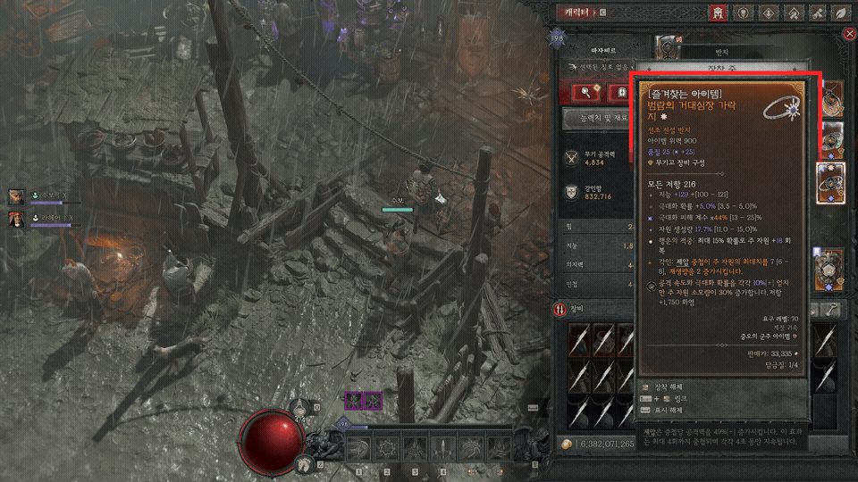

# D4LF koKR 개인 테스트판

원본 [D4LF](https://github.com/d4lfteam/d4lf)를 한국어 디아블로 IV 클라이언트에서 사용해 보려고 수정 중인 개인 작업물입니다.

아직 버그가 많습니다. 한국어 아이템 이름과 옵션 판정이 틀릴 수 있고, 장비 스캔과 보관함 기능도 모든 환경에서 확인되지 않았습니다. 완성판이나 공식 배포본이 아닙니다.

## 실제 테스트 화면

아래 GIF는 테스트 중 제보에 사용했던 실제 게임 캡처 두 장을 번갈아 보여줍니다. 실시간 녹화가 아니며, 빨간 테두리처럼 판정이 잘못된 장면도 포함되어 있습니다.

## 이 저장소에 있는 것

- 한국어 지원을 위한 수정 소스
- 테스트 캡처 GIF
- 실행 환경이 포함된 204MB 포터블 ZIP은 용량 때문에 포함하지 않았습니다.

## 실행 파일 안내

- `D4LF-koKR-start.bat`: 소스 폴더용입니다. `uv`가 없으면 Windows Package Manager로 설치를 시도하고, `uv sync`로 실행에 필요한 패키지를 준비합니다.
- `D4LF-koKR-portable.bat`: 포터블 ZIP용입니다. 이 저장소에는 `runtime\python.exe`가 없어서 여기서 바로 실행되지 않습니다. 전체 포터블 ZIP을 받은 경우에 사용하세요.

따라서 GitHub의 `Code → Download ZIP`만으로는 포터블 실행이 되지 않습니다. 현재 저장소는 수정 소스를 살펴보거나 내려받기 위한 공간이며, 바로 실행할 완성 ZIP은 제공하지 않습니다.

원본 프로그램과 라이선스는 [D4LF 저장소](https://github.com/d4lfteam/d4lf)를 확인해 주세요. 이 저장소는 원본 개발팀과 관계없는 비공식 개인 수정본입니다.

오류를 제보할 때는 아이템 화면, 사용한 프로필 이름, D4LF 로그를 함께 적어 주세요.
